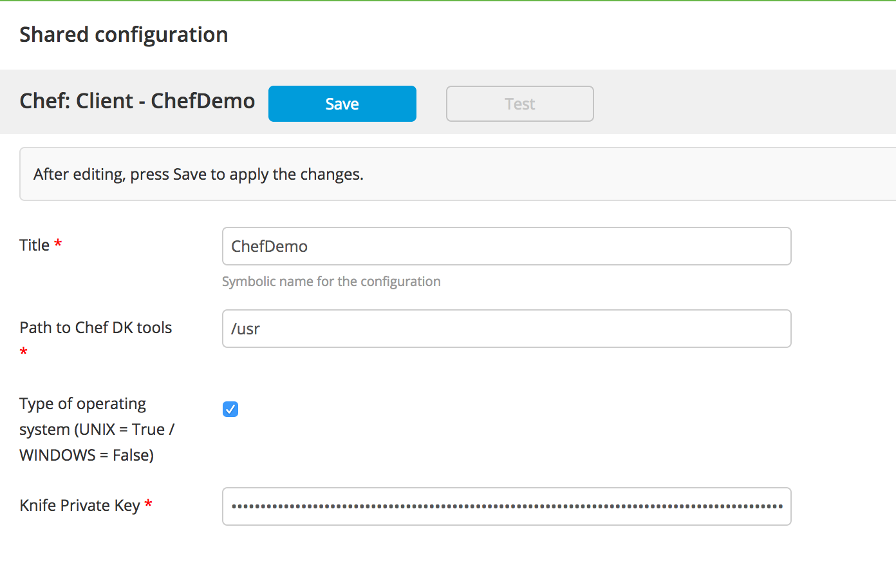

#XL Release Chef Plugin

## Preface
This document describes the functionality provide by the `xlr-chef-plugin`

## Overview
This module offers tasks to apply Chef cookbooks on a remote hosts.

## Installation
Copy the plugin JAR file into the `SERVER_HOME/plugins` directory of XL Release.

## Chef CI
The Chef plugin can connect to multiple Chef servers or connect to the same server with different shared credentials.  The Configuration Item for a Chef server screen looks like the following:

## Chef Tasks

### Bootstrap Unix Tasks
The bootstrap unix task bootstraps a unix server into your chef server

### Delete Client
The delete client task deletes the client from your chef server

### Delete Node
The delete node tasks deletes the node from your chef server

### Get Cookbook List
Get a list of the cookbooks in the Chef Server

---

## References:
* [https://docs.chef.io/](https://docs.chef.io/)
* [https://docs.chef.io/knife_data_bag.html](https://docs.chef.io/knife_data_bag.html)
* [https://gist.github.com/jtimberman/1302749](https://gist.github.com/jtimberman/1302749)
* [http://misheska.com/blog/2013/06/16/getting-started-writing-chef-cookbooks-the-berkshelf-way/](http://misheska.com/blog/2013/06/16/getting-started-writing-chef-cookbooks-the-berkshelf-way/)

