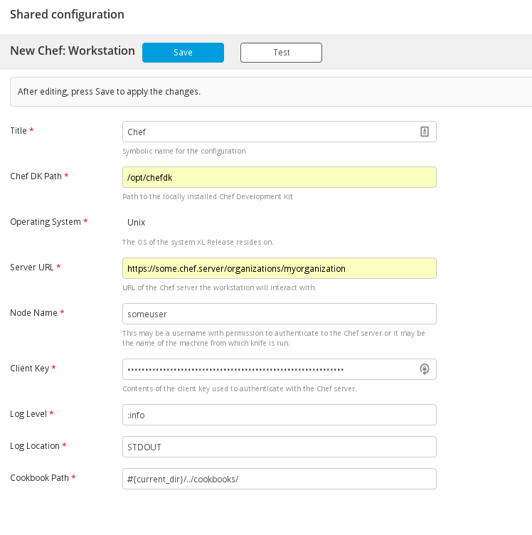
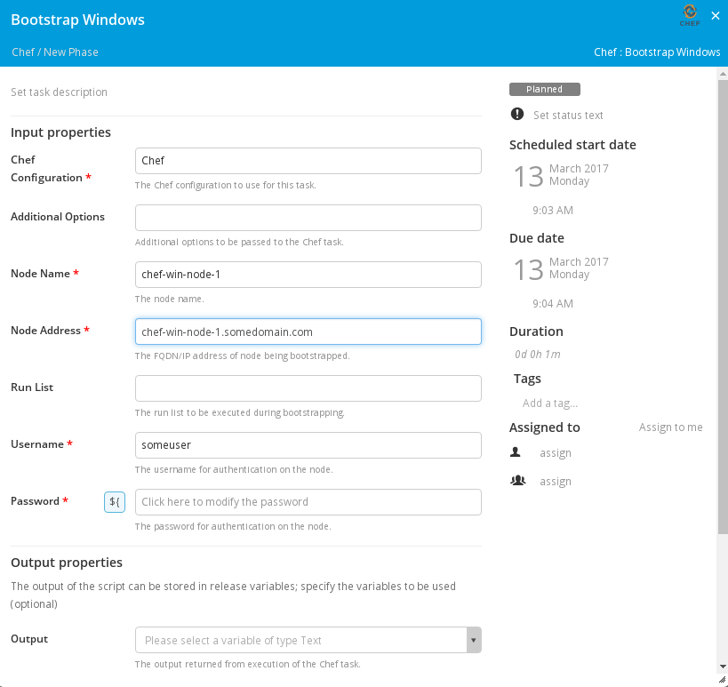
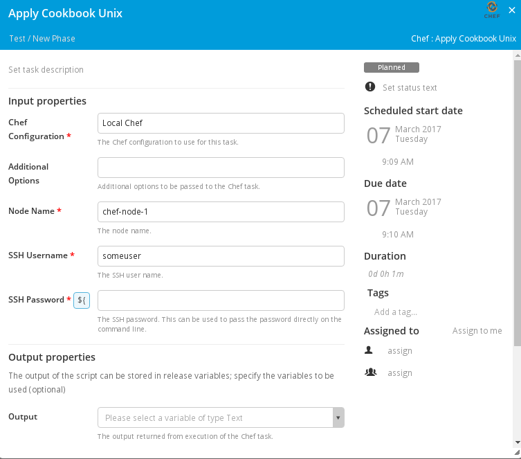

#XL Release Chef Plugin

## Preface
This document describes the functionality provide by the `xlr-chef-plugin`

## Overview
This module offers a basic interface to Chef functionality on a Chef server as well as Chef Nodes.

## Installation
Copy the plugin JAR file into the `SERVER_HOME/plugins` directory of XL Release.

## Workstation CI
The Chef plugin can connect to multiple Chef servers or connect to the same server with different shared credentials. In this configuration, the XL Release Server is acting as a Chef Workstation, and needs to have access to the . The Configuration Item for the Chef Workstation screen looks like the following:

## Chef Tasks

### Bootstrap Unix Task
The Bootstrap Unix task bootstraps a unix node into your Chef server.

### Bootstrap Windows Task
The Bootstrap Windows task bootstraps a windows node into your Chef server.

### Client List
The Client List task returns a list of clients from your Chef server.

### Node List
The Node List task returns a list of nodes from your Chef server.

### Show Node
The Show Node task returns the details of a specified node from your Chef server.

### Delete Client
The Delete Client task deletes the client from your Chef server.

### Delete Node
The Delete Node task deletes the node from your Chef server.

### Cookbook List
The Cookbook List task retrieves a list of the cookbooks in the Chef server.

### Set Runlist
The Set Runlist task sets the run_list for a specified node.

### Apply Cookbook Unix
The Apply Cookbook Unix task applies a cookbook to a specified unix node.

### Apply Cookbook Windows
The Apply Cookbook Windows task applies a cookbook to a specified windows node.

---

## References:
* [https://docs.chef.io/](https://docs.chef.io/)
* [https://docs.chef.io/knife_data_bag.html](https://docs.chef.io/knife_data_bag.html)
* [https://gist.github.com/jtimberman/1302749](https://gist.github.com/jtimberman/1302749)
* [http://misheska.com/blog/2013/06/16/getting-started-writing-chef-cookbooks-the-berkshelf-way/](http://misheska.com/blog/2013/06/16/getting-started-writing-chef-cookbooks-the-berkshelf-way/)

