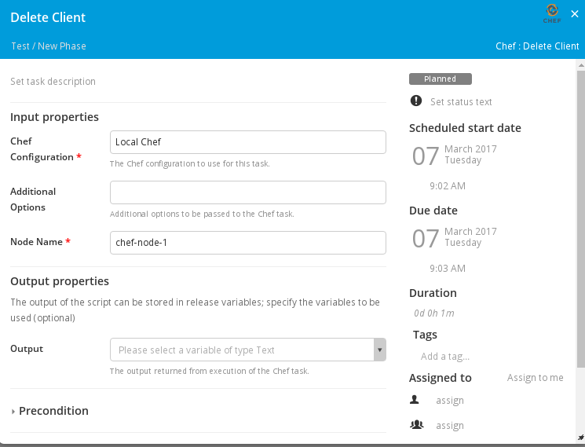

#XL Release Chef Plugin

## Preface
This document describes the functionality provide by the `xlr-chef-plugin`

## Overview
This module offers tasks to apply Chef cookbooks on a remote hosts.

## Installation
Copy the plugin JAR file into the `SERVER_HOME/plugins` directory of XL Release.

## Chef Tasks

### Bootstrap Unix Tasks
The bootstrap unix task bootstraps a unix server into your chef server

### Delete Client
The delete client task deletes the client from your chef server

### Delete Node
The delete node tasks deletes the node from your chef server

### Get Cookbook List
Get a list of the cookbooks in the Chef Server

